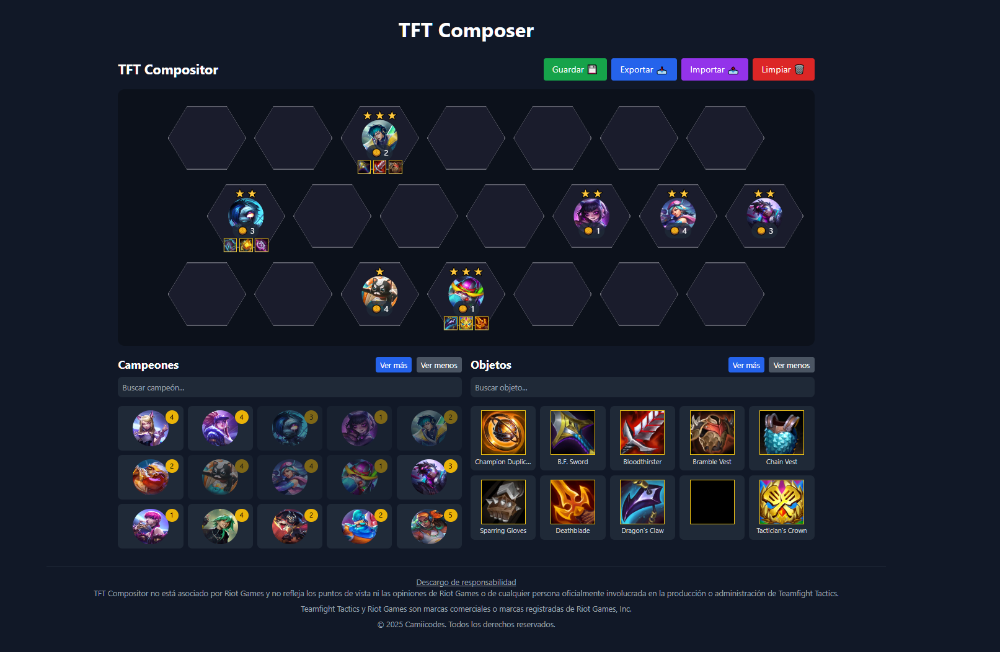

# 🧩 Compos TFT - Armador de composiciones para Teamfight Tactics

Una aplicación web minimalista desarrollada en **Astro + React** para crear, visualizar y compartir composiciones de campeones y objetos en **Teamfight Tactics (TFT)**.

Ideal para jugadores que quieren planear sus partidas o compartir sus builds favoritas con facilidad.



---

## 🚀 Características

- 🎮 Arrastra y organiza campeones en una composición.
- 🧠 Selecciona objetos, niveles y habilidades de forma visual.
- 🔄 Información obtenida directamente desde la API oficial de Riot y Data Dragon.
- 🌐 Aplicación ligera y responsiva hecha con Astro.

---

## 💡 Futuras mejoras (To-Do)

- Soporte para guardar composiciones localmente
- Filtros por sinergias, costos, clases
- UI/UX refinada para mobile

---

## ⚙️ Instalación

1. Clona el repositorio:

    ```bash
    git clone https://github.com/camiicode/compos-tft.git
    cd compos-tft
    ```

2. Instala la Dependencias

    ```bash
    npm i
    cd compos-tft
    ```

3. Crea un archivo `.env` en la raiz del proyecto y coloca tu clave API de RIOT

    ```bash
    RIOT_API_KEY=tu_clave_aquí
    ```

4. Inicia el servidor de desarrollo:

    ```bash
    npm run dev
    ```

5. Puedes ver un ejemplo en el archivo `/.env.example`

## 🛡️ Seguridad

Tu archivo `.env` está excluido del repositorio (.gitignore). Nunca subas tu clave API. Asegúrate de tener cuidado al hacer commits si modificas este archivo.

## 🧠 CREDITOS

- Datos e imágenes gracias a Riot Games y Data Dragon

## 📜 Licencia

[LICENSE](./LICENSE)

## TFT Compositor

TFT Compositor es una aplicación para crear y compartir composiciones de Teamfight Tactics. Permite a los usuarios:

- Arrastrar y soltar campeones en un tablero hexagonal.
- Equipar objetos a los campeones.
- Ajustar el nivel de estrellas de los campeones.
- Guardar y cargar composiciones desde el almacenamiento local.
- Importar y exportar composiciones en formato JSON.
- Mover campeones en el tablero sin perder objetos o niveles.
- Ver una lista de campeones y objetos disponibles.
- Buscar campeones y objetos por nombre.

## Instalación

1. Clona el repositorio.
2. Ejecuta `npm install` para instalar las dependencias.
3. Ejecuta `npm run dev` para iniciar la aplicación en modo de desarrollo.

## Contribución

Por favor, consulta el archivo `CONTRIBUTING.md` para obtener detalles sobre nuestro proceso de contribución.
